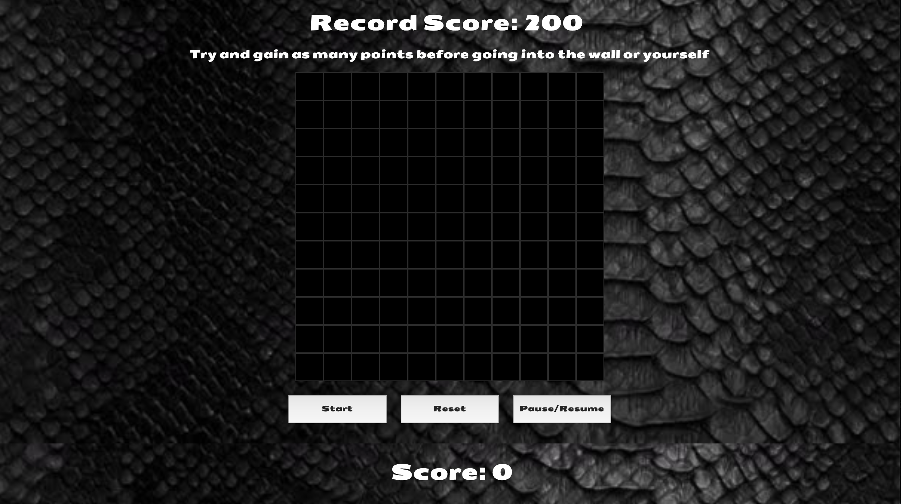
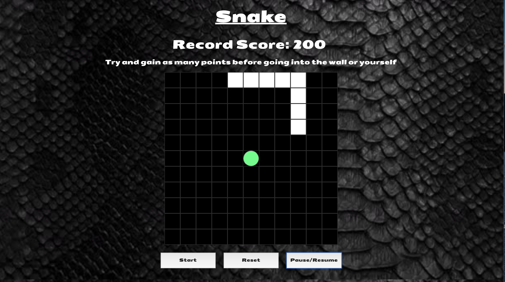
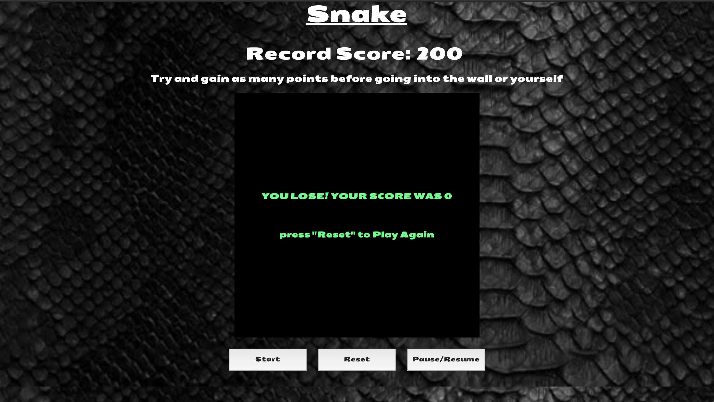

# Software Engineering Immersive: Project 1
This was my first project built whilst studying the Software Engineering Immersive course at General Assembly.

This game was built in one week during Week 4 of the course.

# Snake I

## Brief
- **Render a game in the browser**
- **Design logic for winning & visually display which player won**
- **Include separate HTML / CSS / JavaScript files**
- Stick with **KISS (Keep It Simple Stupid)** and **DRY (Don't Repeat Yourself)** principles
- Use **Javascript** for **DOM manipulation**
- **Deploy your game online**, where the rest of the world can access it
- Use **semantic markup** for HTML and CSS (adhere to best practices)

## Tech Stack
This project was built using the following technologies.
+ HTML5
+ CSS3
+ JavaScript (ES6)
+ Git & GitHub

## Release History

+ 1.0 - This game will not be updated which is staying true to the challenge of building it in one week. This also is to serve as a benchmark for how much I have improved since the date (10/01/20) this was submitted, which was three teaching weeks into the course. Any improvements stated to be made to it will be done so in a follow up project.

## Deployment
The game is deployed utilising GitHub Pages and it can be found here via this link - [Snake I](http://bit.ly/git-snake)

## Getting Started
If you would like to fork/clone this game to your own repository, please feel free to do so. 

You then need to open the index.html file in your browser and the game should start. All images are stored in the games asset folder if you would like to customise the game with your own style.

## Game Architecture
Snake is a single player game. The object of the game is to navigate the grid and eat as many green apples(gain as many points) as possible without hitting the wall or yourself. The more apples eaten the faster the speed of the snake, thus increassing difficulty.



Here you can see the snake during gameplay.


Here you can see what happen when you make a mistake


## Challenges and Improvements

### Challenges
The main challenges I had on this project were...
1. Making sure the snake movement and growth was smooth.
2. Ensuring the the green apples would generate on a random square
3. Handling the movement of the snake

1. To ensure the snake movement was smooth, I had a function that used the pop and push function for arrays to make sure that the snake head moved its head to a new square, each other square would pop and push to the next.

2. Ensuring the green apples would generate on a random square. 

The function I used 'generateFood' used math random with the width (which is a variable that can be changed easily' and then once generated, it will add the css style i.e add an apple to a random square in the grid.

```js
function generateFood (){
   let randomNumber = Math.floor(Math.random() * (width * width))

    while (snakeArray.includes(randomNumber)) {
      randomNumber = Math.floor(Math.random() * (width * width))
    }
    squares[randomNumber].classList.add('food')
  }

```

3. Initially, I had some difficulty planning the movement of the snake as this was my first project in coding and knowing where to start was a challenge. However, after planning and looking at other snakes in gameplay, I managed to formulate a plan for the movement of my snake.

The 'moveSnake' function checks which key( direction was chosen and then will move the snake relative to where it is in the game) . Also I added in the function that if the snake did not have anywhere to go i.e hit itself or the wall, the game would be over.

```js
  // SNAKE MOVEMENT()
  function moveSnake() {
    if (direction === 'right' && snakeArray[0] % width < width - 1) {
      moveRight()
      // direction !== 'left'
    } else if (direction === 'left' && snakeArray[0] % width > 0){
      moveLeft()
      // direction !== 'right'
    } else if (direction === 'down' && snakeArray[0] + width < width * width){
      moveDown()
      // direction !== 'up'
    } else if (direction === 'up' && snakeArray[0] - width >= 0){
      moveUp()
      // direction !== 'down'
    } else {
      removeSnake()
      clearInterval(intervalId)
      grid.innerHTML = `<div><p>YOU LOSE! YOUR SCORE WAS ${playerP}</p><br><p> press "Reset" to Play Again</p></div>`
      storeScores()
      console.log('player would of lost')
      
    }

```
### Improvements
The improvements I would like to make on this game would be the following...

1. Turn Snake I into Snake II and the snake could go through walls.
2. Making the game mobile responsive so it adjusts to mobile displays and listens for touchscreen presses.
4. Add some more types of food that have different points. 

#### Author

Rory Fletcher

#### Initial thoughts straight after handing in the project 

Challenges- 
- Initally, planning the game and splitting it into sections
- Where to start from
- Implementing some of the plan from pseudocode to JS code

Wins-
- Working out a good method to plan and split project into sections
- Changing perspective on seeing how a game is made up of different types of coding languages (HTML, CSS, JS) and then seeing what code needs to be editted to get result required.
